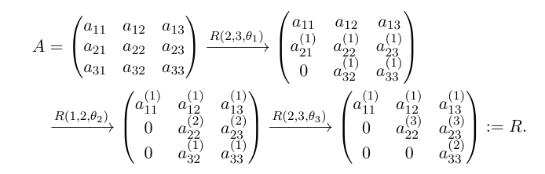

# 2024/9/12
# LS
Given a vector of inputs $X^T=(X_1,X_2,\ldots,X_p)$, we predict the output $Y$ via the model

$\hat{Y}=\hat{\beta _0}+\sum ^p_{j=1} X_j \hat{\beta _j}$

- $\hat{\beta _0}$ is bias

then we get the loss function: 

$RSS(\beta)=\sum ^N_{i=1} (y_i-x_i^T \beta)^2=(y-X \beta)^T(y-X \beta)$

differentiating w.r.t. $\beta$ we get the normal equations

$X^T(y-X \beta)=0 \implies \hat{\beta} = (X^TX)^{-1}X^Ty$

Or we can solve this problem in geometic views:

$\hat{\beta} = \argmin ||y-X \beta||_2$, it is the distance from y to the range space R(X). It is known that $X \beta \in R(A)$ is the closest point in R(A) to y $\Longleftrightarrow$

$(y-X\beta,X\beta)=0,\forall \beta \in R^n$

$\implies X^T(y-X\beta)=0 \implies \hat{\beta}=(X^TX)^{-1}X^Ty$

# LS Solution
Given Ax=b
## QR Decomposition

### Why QR?
when the size of A is not small, the condition number $\kappa (A)$ could be large and solving the normal equation may lead to significant round-off error

### Gram-Schmidt
For $A=QR$, we can get $q_i$ by this: (subtract the projections of the former dimensions)

$$
q_1 = a_1 \\
q_2 = a_2 - \frac{r_1 \cdot q_1}{||q_1||^2} q_1 \\
\vdots \\
q_n = a_n - \sum_{i=1}^{n-1} \frac{r_n \cdot q_i}{||q_i||^2} q_i \\
$$

Thus, we get CGS

**Classical Gram–Schmidt (CGS)**
---
$$
\begin{aligned}
&\text{Input: } a_1, a_2, \ldots, a_n \in \mathbb{R}^m, q_0 = 0. \\
&\text{for } k = 1, 2, \ldots, n \text{ do} \\
&\quad\quad  q_k = a_k; \\
&\quad\quad \text{for } j = 1, 2, \ldots, k-1 \text{ do} \\
&\quad\quad\quad\quad r_{jk} = (a_k, q_j); \\
&\quad\quad\quad\quad q_k = q_k - r_{jk} q_j; \\
&\quad\quad \text{end for} \\
&\quad\quad r_{kk} = \|q_k\|_2 \\
&\quad\quad q_k = \frac{q_k}{r_{kk}}; \\
&\text{end for} \\
\end{aligned}
$$

**Modified Gram-Schmidt (MGS)**
---
$$
\begin{aligned}
&\text{Input: } a_1, a_2, \ldots, a_n \in \mathbb{R}^m, q_0 = 0. \\
&\text{for } k = 1, 2, \ldots, n \text{ do} \\
&\quad\quad  q_k = a_k; \\
&\quad\quad \text{for } j = 1, 2, \ldots, k-1 \text{ do} \\
&\quad\quad\quad\quad r_{jk} = (q_k, q_j); \\
&\quad\quad\quad\quad q_k = q_k - r_{jk} q_j; \\
&\quad\quad \text{end for} \\
&\quad\quad r_{kk} = \|q_k\|_2 \\
&\quad\quad q_k = \frac{q_k}{r_{kk}}; \\
&\text{end for} \\
\end{aligned}
$$

---

```python
import numpy as np


def cgs(A):
    """Classical Gram-Schmidt (CGS)"""
    m, n = A.shape
    Q = np.zeros((m, n))
    R = np.zeros((n, n))
    for k in range(n):
        Q[:, k] = A[:, k]
        for j in range(k):
            R[j, k] = np.dot(Q[:, j], A[:, k])
            Q[:, k] -= R[j, k] * Q[:, j]
        R[k, k] = np.linalg.norm(Q[:, k])
        Q[:, k] /= R[k, k]
    return Q, R

def mgs(A):
    """Modefied Gram-Schmidt (MGS)"""
    m, n = A.shape
    Q = np.zeros((m, n))
    R = np.zeros((n, n))
    for k in range(n):
        Q[:, k] = A[:, k]
        for j in range(k):
            R[j, k] = np.dot(Q[:, j], Q[:, k])
            Q[:, k] -= R[j, k] * Q[:, j]
        R[k, k] = np.linalg.norm(Q[:, k])
        Q[:, k] /= R[k, k]
    return Q, R

A = np.random.rand(100, 100)

Q_cgs, R_cgs = cgs(A)
Q_mgs, R_mgs = mgs(A)

print("CGS Ans:")
print(np.linalg.norm(Q_cgs@R_cgs-A))

print("\nMGS Ans:")
print(np.linalg.norm(Q_mgs@R_mgs-A))
```

### Householder Reflection
Given a unit vector u, there is a matrix H corresponding to the reflection transformation perpendicular to u

$H=I-2uu^T$

By choosing suitable u, one can reduce a vector x to 

$Hx=x-2u(u^Tx)=ce_1=c(1,0,\ldots,0)^T$

Using $||Px||=||x||_2$, we have $|c|=||x||_2$

$u=\frac{1}{2u^Tx}(x-ce_1)=\frac{\bar{u}}{||\bar{u}||_2}$

$\implies$

$\bar{u}=x+sign(x_1)||x||_2 e_1$

why $sign(x_1)$? It is to ensure that the absolute value of the first component is the largest, thereby reducing rounding errors.

Applying such a $H=H_1$ with $x=a_1$ to $A=[a_1,a_2,\ldots,a_n]$, we have

$$
H_1A=
\begin{bmatrix}
* & * & * & \cdots & * \\
0 & * & * & \cdots & * \\
0 & * & * & \cdots & * \\
\vdots & \vdots & \vdots & \ddots & \vdots \\
0 & * & * & \cdots & *
\end{bmatrix}
$$

then we apply 
$$
H_2=
\begin{bmatrix}
* & \cdots \\
\vdots & H'_2
\end{bmatrix}
$$
to $H_1A$ and so on

$$
H_1H_2 \ldots H_nA=
\begin{bmatrix}
* & * & * & \cdots & * \\
0 & * & * & \cdots & * \\
0 & 0 & * & \cdots & * \\
\vdots & \vdots & \vdots & \ddots & \vdots \\
0 & 0 & 0 & \cdots & 1
\end{bmatrix}
=R
$$

then we get

$$
Q=H_1^TH_2^T\ldots H_n^T \\
R=H_1H_2 \ldots H_nA \\
$$

---

```python
import numpy as np

def householder_reflection(A):
    """Perform QR decomposition of matrix A using Householder reflection."""
    m, n = A.shape
    Q = np.eye(m)
    R = A.copy()
    for i in range(n):
        x = R[i:, i]
        e = np.zeros_like(x)
        e[0] = np.linalg.norm(x)
        c = -np.sign(x[0]) * np.linalg.norm(x)
        u = x + np.sign(x[0]) * np.linalg.norm(x) * e
        v = u / np.linalg.norm(u)
        Q_i = np.eye(m)
        Q_i[i:, i:] -= 2.0 * np.outer(v, v)
        R = Q_i @ R
        Q = Q @ Q_i.T
    return Q, R

A = np.random.rand(40, 40)

Q, R = householder_reflection(A)
print("Householder Reflection Ans:")
print("Q =", Q)
print("R =", R)
print("norm(Q @ R - A) =", np.linalg.norm(Q @ R - A))
```

### Givens Rotation

Givens Rotation is a method used to zero out a specific element of a matrix through a rotation transformation.

The goal of Givens Rotation is to find a Givens matrix $\mathbf{G}$ such that $\mathbf{G} \mathbf{A}$ has a specific element set to zero.

$$
\mathbf{G}(i, j, \theta) = \begin{bmatrix}
1 & & & & \\
& \cos(\theta) & & -\sin(\theta) & \\
& & 1 & & \\
& \sin(\theta) & & \cos(\theta) & \\
& & & & 1
\end{bmatrix}
$$

where $\theta$ is the rotation angle, and $i$ and $j$ are the row and column indices of the element to be zeroed out.

steps:

1. Choose the element $a_{ij}$ to be zeroed out.
2. Compute the rotation angle $\theta$:
$\cos(\theta) = \frac{a_{ii}}{\sqrt{a_{ii}^2 + a_{ij}^2}}$,
$\sin(\theta) = \frac{a_{ij}}{\sqrt{a_{ii}^2 + a_{ij}^2}}$
3. Construct the Givens matrix $\mathbf{G}$.
4. Compute $\mathbf{G} \mathbf{A}$.

eg:



---
```python
import numpy as np

def givens_rotation(A):
    """Perform QR decomposition using Givens Rotation"""
    m, n = A.shape
    Q = np.eye(m)
    R = A.copy()
    for j in range(n):
        for i in range(m-1, j, -1):
            G = np.eye(m)
            a, b = R[i-1, j], R[i, j]
            r = np.hypot(a, b)
            c, s = a/r, -b/r
            G[[i-1, i], [i-1, i]] = c
            G[i, i-1], G[i-1, i] = s, -s
            R = G @ R
            Q = Q @ G.T
    return Q, R

A = np.random.rand(40, 40)

Q, R = givens_rotation(A)
print("Givens Rotation Result:")
print("Q =", Q)
print("R =", R)
print("norm(Q @ R - A) =", np.linalg.norm(Q @ R - A))
```