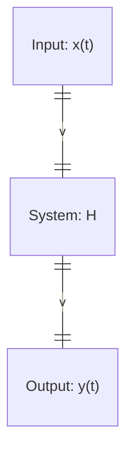

# 2024/9/26
## Given x(t), assume x(t)=x(t+T),

$$
\exist T,x(t)=\sum_{k=-\infty}^\infty \alpha_k e^{j\frac{2k\pi}{T}t}\\
\alpha_k=\frac{1}{T}\int_{-\frac{T}{2}}^{\frac{T}{2}}x(t)e^{-j\frac{2k\pi}{T}t}dt
$$

$T \rightarrow \infty$,

$$
\begin{aligned}
x(t)&=\lim_{T\rightarrow \infty}\sum_{k=-\infty}^\infty (\frac{1}{T}\int_{-\frac{T}{2}}^{\frac{T}{2}}x(t)e^{-j\frac{2k\pi}{T}t}dt) e^{j\frac{2k\pi}{T}t}\\
&=\frac{1}{2\pi}\lim_{T\rightarrow \infty}\sum_{k=-\infty}^\infty (\int_{-\frac{T}{2}}^{\frac{T}{2}}x(t)e^{-j\frac{2k\pi}{T}t}dt) e^{j\frac{2k\pi}{T}t}\frac{2\pi}{T}\\
&=\frac{1}{2\pi}\int_{-\infty}^\infty \hat{x}(\omega)e^{j\omega t}d\omega\\
\hat{x}(\omega)&=\int_{-\infty}^\infty x(t)e^{-j\omega t}dt
\end{aligned}
$$

## x(t): random signal

$$
\text{usually cannot meet}\int_{-\infty}^\infty|x(t)|\lt \infty
$$

## Power Spectrum Density

$$
\begin{aligned}
&\lim_{T\rightarrow \infty} \frac{1}{T}E(|\int_{-T/2}^{T/2}x(t)e^{-j\omega t}dt|^2)=\int_{-\infty}^\infty R_x(\tau)e^{-j\omega\tau}d\tau=S_x(\omega) \\
&\mathcal{F}[R_x(\tau)]=S_x(\omega) \\
&\mathcal{F}^{-1}[S_x(\omega)]=R_x(\tau) \\
&\int_{-\infty}^\infty S_x(\omega)d\omega=2\pi R_x(0)=E(x^2(t)) \\ 
\end{aligned}
$$

- No Phase, No Inverse
- Nonlinear $S_{x_1+x_2}(\omega)\neq S_{x_1}(\omega)+S_{x_2}(\omega)$

- $S_x(\omega) \geq 0$
- $S_x(\omega)=S_x(-\omega)$

### 1.
$$
x(t),w.s.s.,R_x(t) \\
prove: R_x(0)-R_x(\tau) \geq \frac{1}{4^n}(R_x(0)-R_x(2^n\tau)) \\
$$
proof:

firstly prove:
$$
R_x(0)-R_x(\tau) \geq \frac{1}{4}(R_x(0)-R_x(2\tau)) \\
\Longleftrightarrow
3R_x(0)-4R_x(\tau)+R_x(2\tau) \geq 0 \\
\begin{aligned}
3R_x(0)-4R_x(\tau)+R_x(2\tau)&=\frac{1}{2\pi}\int_{-\infty}^\infty S_x(\omega)(3-4\cos(\omega \tau)+\cos(2 \omega \tau)) d\omega \\
&=\frac{1}{\pi} \int_{-\infty}^\infty S_x(\omega)(\cos(\omega \tau)-1)^2d\omega \\
&\geq 0 \\
\end{aligned}
$$

### 2.
$$
f(\omega) \geq 0, \text{construct }x(t),s.t. S_x(\omega)=2 \pi f(\omega) \\
\begin{aligned}
\text{Let } x(t)&=\exp(j\omega t),\omega \text{ random },\omega \sim f(\omega)\\
R_x(\tau)&=E(x(t)x^*(t-\tau))=E(\exp(j\omega t)\exp(-j\omega (t-\tau)))\\
&=E(\exp(j\omega \tau))\\
&=\int_{-\infty}^\infty f(\omega)\exp(j\omega\tau)d\omega \\
&=\frac{1}{2\pi}\int_{-\infty}^\infty 2\pi f(\omega)e^{j\omega\tau}d\omega \\
\implies &S_x(\omega)=2 \pi f(\omega) \\
\end{aligned}
$$

### 3.

$$
S_Y(\omega)=?,S_x(\omega)=? \\

\begin{aligned}
R_Y(t,s)&=E(Y(t)Y(s))\\
&=E((\int_{-\infty}^\infty h(t-\tau)x(\tau)d\tau)(\int_{-\infty}^\infty h(s-r)x(r)dr)) \\
&=\int_{-\infty}^\infty\int_{-\infty}^\infty h(t-\tau)h(s-r) E(x(\tau)x(r))dtds \\
&=\int_{-\infty}^\infty\int_{-\infty}^\infty h(t-\tau)h(s-r) R_x(\tau-r)dtds \\ 
&\overset{\text{Let}\tilde{h}(t)=h(-t)}{=} \int_{-\infty}^\infty\int_{-\infty}^\infty h(t-\tau)\tilde{h}(r-s) R_x(\tau-r)dtds \\ 
&=(h*\tilde{h}*R_x)(t-s) \\
\implies  S_Y(\omega)&=H(\omega)\cdot \tilde{H}(\omega) \cdot S_x(\omega) \\
&=|H(\omega)|^2S_x(\omega) \\
\end{aligned}
$$

### 4.
$$
y(t)=x(t)-x(t-1) \\
\implies \\
Y(\omega)=X(\omega)-\exp(-j\omega)X(\omega) \\
\implies \\
H(\omega) =\frac{Y(\omega)}{X(\omega)}=1-\exp(j\omega) \\
\implies \\
|H(\omega)|^2=4\sin^2\frac{\omega}{2} \\
$$